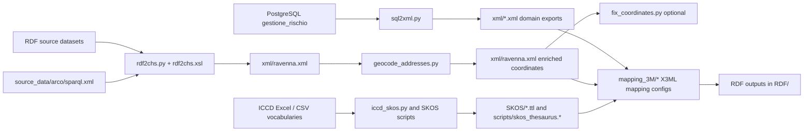

# SIRIUS Mapping

Semantic mapping and ETL toolkit for cultural heritage risk-management data.

The project integrates:
- relational risk data (PostgreSQL),
- heritage RDF datasets,
- controlled vocabularies (SKOS),
- and geospatial enrichment (geocoding),

to produce XML and RDF artifacts ready for mapping workflows (including 3M/X3ML and CIDOC CRM-aligned models).

## Project Goals

- Normalize risk-assessment and cultural-heritage information into machine-readable exchange formats.
- Keep domain knowledge explicit through SKOS vocabularies and semantic mappings.
- Support reproducible, script-based ETL from raw sources to curated outputs.
- Enable downstream semantic publication (RDF exports, X3ML mappings, query/update workflows).

## High-Level ETL Pipeline



## Data Domains Covered

- Cultural heritage sites (`E18`-oriented resources).
- Places (`E53`-oriented resources).
- NARA dimensions/values (`E89_nara` mapping context).
- Risk analysis and risk agents (`E89_risk` mapping context).
- Controlled vocabularies and thesauri (SKOS concepts and hierarchies).

## Scope of the Processes

### In Scope

- Exporting operational data from PostgreSQL tables to canonical XML files.
- Transforming selected RDF into project-specific XML structures.
- Enriching site records with address-based coordinates.
- Building and adjusting SKOS vocabularies for agents/events and thesauri.
- Preparing mapping inputs for 3M/X3ML semantic conversion.
- Producing intermediate and final RDF/XML/Turtle assets for analysis and integration.

### Out of Scope

- Production orchestration (no scheduler/workflow manager included).
- Real-time ETL or streaming ingestion.
- Full data governance lifecycle (approval workflows, stewardship tooling, lineage UI).
- Public API serving and access-control management.
- Automatic deployment/infrastructure provisioning.

## Repository Structure (Functional View)

```text
sirius_mapping/
├── scripts/                      # ETL and utility scripts
│   ├── sql2xml.py                # PostgreSQL -> XML exports for risk/site domains
│   ├── rdf2chs.py                # Runs XSLT to convert RDF input to ravenna.xml
│   ├── rdf2chs.xsl               # Mapping logic RDF -> cultural_heritage_site XML
│   ├── geocode_addresses.py      # Address -> coordinate enrichment with cache/logs
│   ├── fix_coordinates.py        # Optional coordinate pair swap utility
│   ├── iccd_skos.py              # ICCD Excel -> SKOS serialization
│   ├── order_skos.py             # SKOS ordering utility
│   ├── prefix.py                 # Namespace/prefix rebasing for SKOS concepts
│   └── updatedb.py               # Optional XML -> DB update helper
├── xml/                          # Generated and enriched XML outputs
├── RDF/                          # Semantic outputs and working RDF datasets
├── SKOS/                         # Thesauri and vocabulary resources
├── source_data/arco/             # SPARQL query outputs used during enrichment
├── mapping_3M/                   # 3M/X3ML mapping projects and ontology bundles
├── database/                     # DB dump/assets
├── query.sparql                  # SPARQL query and update snippets
└── README.md
```

## Inputs and Outputs by Stage

### 1) Relational Export (PostgreSQL -> XML)

Script: `scripts/sql2xml.py`

Primary outputs in `xml/`:
- `cultural_heritage_site.xml`
- `value_aspect_dimension.xml`
- `value_agents_occurrence.xml`
- `event_name_sentence.xml`
- `risk_analysis.xml`
- `place.xml` (if table is available)

### 2) RDF-to-XML Harmonization

Scripts: `scripts/rdf2chs.py`, `scripts/rdf2chs.xsl`

Reads:
- `RDF/filtered_ravenna.rdf`
- `source_data/arco/sparql.xml` (for address/chronology enrichment)

Writes:
- `xml/ravenna.xml`

### 3) Geospatial Enrichment

Script: `scripts/geocode_addresses.py`

Behavior:
- reads `xml/ravenna.xml`,
- geocodes textual addresses,
- writes coordinates back into `xml/ravenna.xml`,
- persists cache and diagnostics in `scripts/geocode_cache.json` and `scripts/logs/`.

Optional post-process:
- `scripts/fix_coordinates.py` to swap coordinate order when required.

### 4) Vocabulary/SKOS Construction

Scripts: `scripts/iccd_skos.py`, `scripts/order_skos.py`, `scripts/prefix.py`

Generates/updates SKOS files in `scripts/` and `SKOS/` for controlled terminology workflows.

### 5) Semantic Mapping (3M/X3ML)

Resources under `mapping_3M/` define mapping rules and ontology bundles for transforming curated XML to CIDOC CRM-oriented RDF outputs.

## Quick Start (Windows)

### Environment

```powershell
python -m venv .venv
.\.venv\Scripts\Activate.ps1
pip install psycopg2-binary lxml requests rdflib pandas
```

### Typical Run Order

```powershell
# 1) Export relational data
python .\scripts\sql2xml.py

# 2) Convert RDF source to XML working file
python .\scripts\rdf2chs.py

# 3) Enrich addresses with coordinates
python .\scripts\geocode_addresses.py

# 4) Optional coordinate correction
python .\scripts\fix_coordinates.py

# 5) Optional SKOS build/update
python .\scripts\iccd_skos.py
```

## Operational Notes

- `scripts/geocode_addresses.py` supports multi-step geocoding strategies with caching and logs for long runs and retries.
- `query.sparql` contains both update and select query blocks useful for data cleaning and source extraction.
- `database/gestione_rischio.sql` is a PostgreSQL dump-format artifact (restore with PostgreSQL tools).

## Known Limitations

- Some scripts contain environment-specific parameters (for example DB credentials, local paths, API contact values) that should be externalized before production use.
- Process execution is manual/script-driven; ordering and validation are operator-managed.
- Quality checks are mostly procedural (logs and spot checks), not yet packaged as automated tests.

## License

GNU GPL v3. See `LICENSE`.